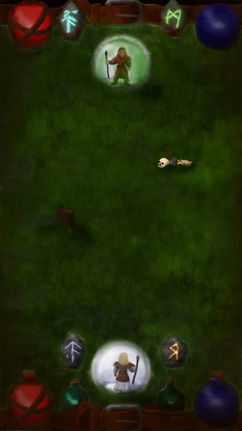
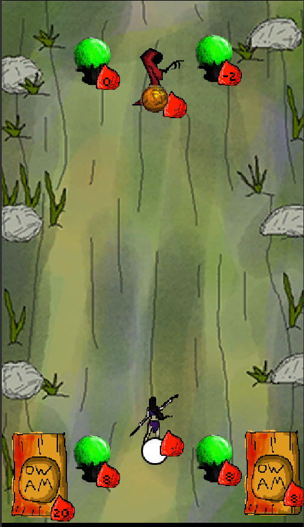

Of Wizards and Mages, a game created in 2014

authors
Krzysztof Bobnis (Programming)
Michal Bartynski (Design)
Maciej Bartynski (Graphics)

Code is playable, but there are errors and game is on a very early stage of development. 

Platform: mobile

Concept:

Current look:

Polish description:
Zdobywaj i rzucaj potężne czary na swoim smartphonie. Zostań najpotężniejszym magiem w dolinie. Rozsadzaj korpusy przeciwników za pomocą przepotężnych czarów. Odbijaj wrogie pociski. Funkcje: pojedynki czarodziejów w dynamicznym czasie rzeczywistym, walki rankingowe, turnieje ze znajomymi, fascynujące czary i tarcze do odblokowania, mechanika gry oparta na gestach, łatwe do zagrania z wieloma wartstwami możliwości i tricków. W grze znajdziesz: Czary - z najprzeróźniejszymi efektami, takie jak wysysanie życia, zablokowanie umysłu, zamrożenie nóg. Bonusy i mikstury - znajdujące się na polu bitwy lub w na Twoim pasie. Takie jak natychmiastowa pięść niebios. Tarcze - dobrze usytuowane odbiją najpotężniejsze czary dając Tobie chwilę do ataku. Elementy planszy, które możesz zniszczyć - takie jak pozostawiony rydwan, zwiędłe drzewo, kurhany poległych przed wiekami. Odbijanie pocisków - brzegi ekranu odbiją pociski, zaskakuj swojego wroga niespodziewanym rykoszetem

